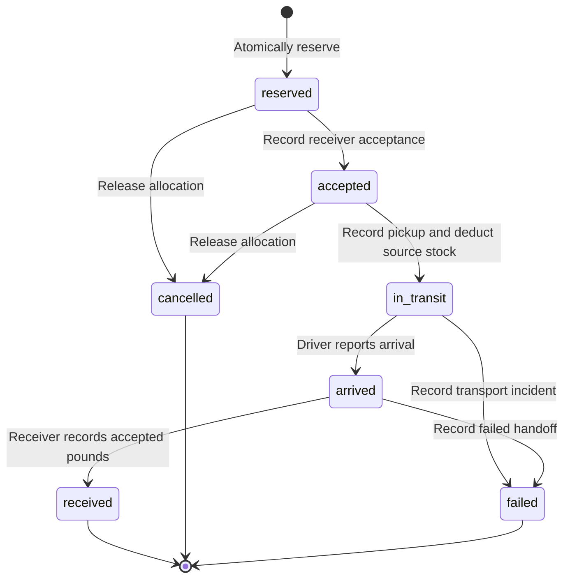

# Architecture and decision record

## One deployable service

A React/TypeScript frontend calls a FastAPI API on the same origin. In a packaged deployment FastAPI serves the compiled frontend. During development, Vite proxies `/api` to the local backend. SQLite stores users, networks, sessions, invitations, pantry sites, food lots, category needs, transfers and events.

This deliberately small deployment fits a supervised network pilot. It avoids vendor-specific infrastructure and usage-based model bills. It is not an architecture for running many horizontally scaled application instances.

## Authentication and tenancy

A successful sign-in creates a server-side session and sets an HttpOnly cookie. State-changing authenticated requests require a CSRF token sent separately in `X-CSRF-Token`. The server derives the user's network from the session; the browser cannot select another tenant by sending a different network ID. The backend applies role checks even if a caller bypasses the interface.

Admin/coordinator roles operate the network. The driver role can record transport steps but cannot alter inventory or certify receiving quantities. An administrator invites a teammate with an expiring one-use link. This version trusts the network operator to verify real identities and pantry membership. It does not implement independently verified nonprofit accreditation or per-pantry ownership permissions.

## Planner

The planner is deterministic, explainable allocation software. It considers source availability after protected reserve and outstanding reservations, unfulfilled destination needs, destination stock/capacity, storage compatibility, operational expiry, cold transport capability and maximum distance. It computes approximate great-circle distances from coordinator-entered coordinates. It does not call a routing service or claim shortest road routes.

It greedily ranks feasible opportunities and decreases virtual supply, demand and capacity after each proposed allocation. This makes the displayed batch internally consistent. Approval rechecks current data inside an atomic transaction, because an earlier plan can become stale.

The objective is useful, understandable suggestions with human approval. It is not a mathematically proven global optimizer, and it does not infer food safety from text or pictures.

## Physical stock and custody

Reserved and accepted transfers reduce availability without moving physical stock. Pickup deducts stock and changes custody. Receipt adds only accepted food to the receiving site's inventory and credits the need by that amount. Rejected pounds are recorded, never silently returned to source inventory. Missing pounds reopen the remaining need. Full rejection is an outcome with zero accepted pounds, not a successful food delivery.

## Data minimization

No beneficiary names, government identifiers, eligibility scores, household profiles or payment data belong in this product. User account details and operational records remain sensitive and need appropriate access, retention and backups. Public demo networks are disposable and must never contain real operational records.

## Deliberate tradeoffs

- SQLite gives a simple deploy and atomic writes; scale is limited to one service instance.
- Conservative transfer restrictions protect the operator's policy; the app cannot determine legal authority.
- A fixed cold-policy check helps the demonstration; the network must confirm compatibility with its actual SOP before deployment.
- No provider email integration means no email cost or delivery dependency. Admins share invite links through their own approved channel.
- Operational windows, road travel time, dispatch assignment, integration/imports, SSO and automated notifications require further development informed by a real pilot.
